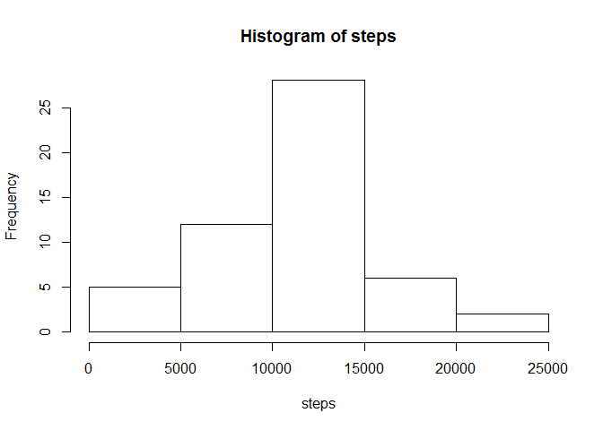
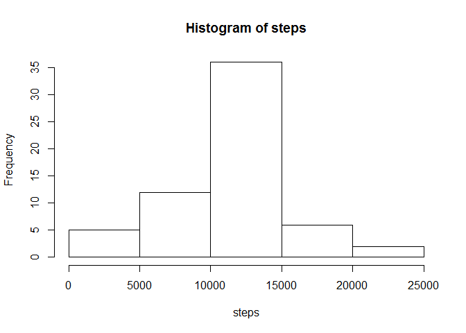

# Reproducible Research: Peer Assessment 1

```r
options(scipen = 1)
```

## Loading and preprocessing the data


```r
data<-read.csv("activity.csv", stringsAsFactors=FALSE)
```

## What is mean total number of steps taken per day?


```r
databyday<-aggregate(steps ~ date, data=data, FUN="sum")
with (databyday,
      hist(steps)
)
```

 

```r
mean<-mean(databyday$steps)
median<-median(databyday$steps)
#Then use `r round(mean,2)` and `r median`
```

Mean: 10766.19

Median: 10765

## What is the average daily activity pattern?


```r
databyinterval<-aggregate(steps ~ interval, data=data, FUN="mean")
with (databyinterval,
      plot(interval, steps, type='l')
)
```

 

```r
busiestinterval<-databyinterval[which.max(databyinterval$steps),]
#Then use `r busiestinterval[1]` and `r round(busiestinterval[2],2)`
```

The interval with the most steps on average is 835 with 206.17 steps.

## Imputing missing values


```r
numbermissing<-sum(is.na(data$steps))
#Then use `r numbermissing`
datanasreplaced<-data
datanasreplaced[is.na(data),1]=databyinterval[match(datanasreplaced[is.na(datanasreplaced$steps),3],databyinterval[,1]),2]

databyday2<-aggregate(steps ~ date, data=datanasreplaced, FUN="sum")
with (databyday2,
      hist(steps)
)
```

 

```r
mean2<-mean(databyday2$steps)
median2<-median(databyday2$steps)
#Then use `r round(mean2,2)` and `r round(median2,2)`
```

There are 2304 rows with 'NA' steps

I'm replacing the missing values with the mean number of steps for that interval calculated across the days where there is data.

Mean: 10766.19

Median: 10766.19

They stay the same - I believe this is because the data is missing in complete days and I have filled in over intervals.

## Are there differences in activity patterns between weekdays and weekends?


```r
datanasreplaced$isweekend[weekdays(as.POSIXct(datanasreplaced$date)) %in% c("Monday","Tuesday","Wednesday","Thursday","Friday")]<-"weekday"
datanasreplaced$isweekend[!weekdays(as.POSIXct(datanasreplaced$date)) %in% c("Monday","Tuesday","Wednesday","Thursday","Friday")]<-"weekend"
datanasreplaced$isweekend<-factor(datanasreplaced$isweekend)

databyinterval2<-aggregate(steps ~ interval + isweekend, data=datanasreplaced, FUN="mean")
library(lattice)
with (databyinterval2,
      xyplot(steps ~ interval|isweekend, type='l', layout=c(1,2))
)
```

 
